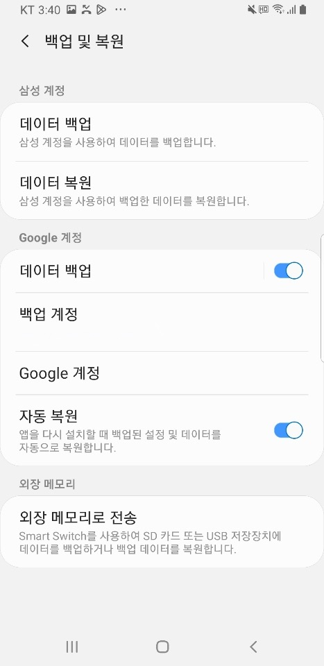
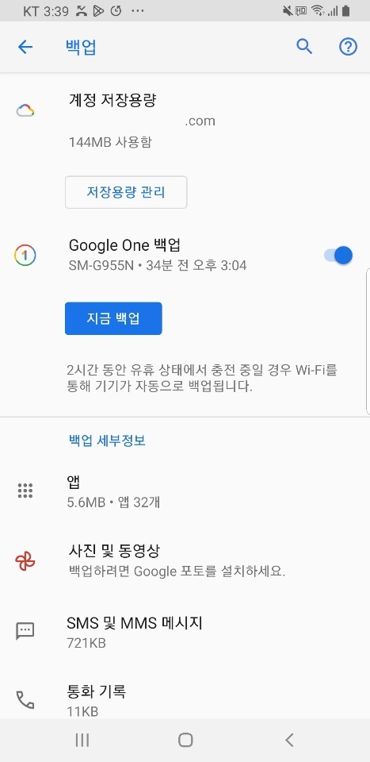
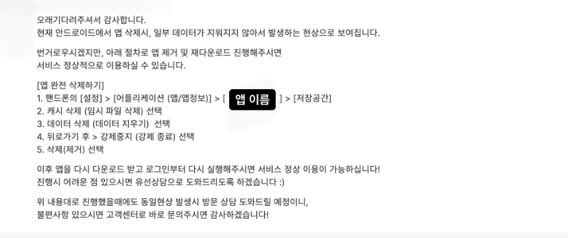

## This is how it happened..

---

네이티브 서비스 앱을 처음 배포하고 마주친 케이스이다. 앱을 삭제하고 다시 설치하였는데도 데이터가 남아있는 현상이 발현됐다. ( ˃̣̣̥᷄⌓˂̣̣̥᷅ ) 회사 서비스의 앱은 앱 초기 실행시 shared preference 데이터로 로그인 뷰로 갈지, 자동 로그인 되는 것처럼 메인 뷰로 진입할지를 결정하는데 이 shared preference의 데이터가 기기에 남아있는 경우였다. 앱을 삭제하고 다시 설치하면 로그아웃 된 것처럼 로그인 페이지로 가는 것이 아니라 바로 메인뷰로 이동하는 현상이었다.

앱을 지우고 다시 깔아도 기존의 유저가 사용하는 데이터가 백업되었다가 복원되어 기존의 데이터를 사용할 수 있게 되는데 안드로이드 메니페이스의 속성중 하나로 `allowBackup`이 `true`로 설정이 되어있으면 백업이 가능한 상태가 된다. 기본적으로 Android 6.0(API 수준 23)이상에서 타겟팅하거나 실행되는 앱의 경우 이러한 백업 속성이 `자동으로` 활성화 되어 있다. allowBackup이 무엇인지 그리고 최근 Android 12부터 달라진 방식까지 알아본다.

## 1. allowBackup

---

```jsx
<manifest ... >
    ...
    <application android:allowBackup="true" ... >
        ...
    </application>
</manifest>
```

> Whether to allow the application to participate in the backup and restore infrastructure. If this attribute is set to false, no backup or restore of the application will ever be performed, even by a full-system backup that would otherwise cause all application data to be saved using adb. The default value of this attribute is true.

안드로이드는 앱 데이터를 사용자의 `Google Drive`에 업로드하고, 이 곳의 앱 데이터는 사용자의 구글 계정 사용자 인증 정보에 따라 보호된다.
<br>
<br>
</span>


즉 백업 데이터는 구글 드라이브 계정에 있는 비공개 폴더에 쌓이게 된다. 데이터 양은 사용자당 25MB로 제한되지만 구글 드라이브 할당량에 포함되지 않고 백업 데이터 보관 비용은 따로 없다. 제한된 데이터 양이 있기에 이전 백업이 있는 경우 삭제하면서 최신 백업만 저장시키고 25MB를 초과하면 시스템이 `onQuotaExceeded`를 호출하고 데이터를 클라우드에 백업하지 않는다. allowBackup값이 true로 설정되어 있어도 기기의 `설정-백업 및 복원`에서 이미지와 같이 구글 계정이 연결되어 있어야한다. 데이터 백업을 허용시켜놓으면 백업이 가능한 환경에서(wifi연결, 기기의 유휴 상태 등) 앱의 정보가 자동으로 백업이 된다. 만약 한 명의 사용자가 2대 이상의 기기를 가지고 있는 경우는 각각의 디바이스를 구분하여 백업을 하고 기기에 맞춰 복원정책을 실행한다.

Android 12(API 수준 31)에서 실행되거나 이를 타겟팅하는 앱에서는 백업 및 복원하는 작동방식이 변경되었다. `allowBackup` 값을 설정해 놓으면 다음과 같은 문구가 뜬다.

> The attribute android:allowBackup is deprecated from Android 12 and higher and may be removed in future versions. Consider adding the attribute android:dataExtractionRules specifying an @xml resource which configures `cloud backups` and `device transfers` on Android 12 and higher.

클라우드 백업과 기기 간 전송 두 가지를 나눠서 설정하길 의도하는 내용이다. 실제 dataExtractionRules.xml 파일에도 cloud-backup과 device-transfer를 구분 짓고 있다.

- `클라우드 백업`: 사용자 데이터가 사용자의 Google Drive에 저장되므로 나중에 기존 기기나 새 기기에서 복원할 수 있다. <br>
- `기기 간(D2D) 전송`: 사용자 데이터가 기존 기기에서 사용자의 새 기기로 직접 전송(예: 케이블 사용)

Android 12 이상에서 실행되거나 타겟팅하는 앱은 allowBackup 속성을 false로 지정헤도 Google Drive 백업은 사용 중지되지만 앱의 D2D 전송은 사용 중지되지 않는다. 매니페스트 파일에서 `android:dataExtractionRules` 속성을 사용하여 앱이 새 XML 구성을 가리키도록 한다. 이 속성을 사용하면 이 전의 `android:fullBackupContent` 속성은 무시된다.

```jsx
<application ...>
  android:dataExtractionRules="@xml/data_extraction_rules"
</application>
```

`res/xml` 디렉토리에 `data_extraction_rules`이라는 xml 파일이 자동으로 생성되고, `include`와 `exclude` 요소를 사용하여 규칙을 만들어준다. 아래와 같이 설정한다면 구글 클라우드에는 shared preference 데이터의 `device.xml`를 제외한 모든 공유 환경설정을 백업한다는 뜻이다. `domain`은 리소스의 위치를 지정한다. `path`는 백업에 포함하거나 제외할 파일 또는 폴더를 지정한다.

- `root` - 이 앱에 속한 모든 비공개 파일이 저장된 파일 시스템의 디렉토리
- `file` - `getFilesDir()`에서 반환한 디렉토리
- `database`- `getDatabasePath()`에서 반환한 디렉토리
- `sharedpref` - `SharedPreferences`가 저장된 디렉토리
- `external` - `getExternalFilesDir()`에서 반환한 디렉토리

```jsx
<?xml version="1.0" encoding="utf-8"?>
<data-extraction-rules>
    <cloud-backup>
        <include domain="sharedpref" path="."/>
        <exclude domain="external" path="device.xml"/>
    </cloud-backup>
    <device-transfer>
        <exclude domain="root" />
        <exclude domain="file" />
        <exclude domain="database" />
        <exclude domain="sharedpref" />
        <exclude domain="external" />
    </device-transfer>
</data-extraction-rules>
```

## 2. 어떤 데이터를 저장하는가?

---

- `공유 환경설정 파일`
- `getFilesDir()` 또는 `getDir`(String, int)을 사용하여 액세스하는 앱의 내부 저장소에 저장된 파일
- `getDatabasePath`(String)에서 반환한 디렉터리의 파일(이 디렉터리는 SQLiteOpenHelper 클래스를 사용하여 생성한 파일도 포함함)
- `getExternalFilesDir`(String)에서 반환한 디렉터리의 외부 저장소에 있는 파일
- `getCacheDir()`, `getCodeCacheDir()`, `getNoBackupFilesDir()`에서 반환한 디렉터리에 있는 파일을 자동 백업에서 제외된다. 이 위치에 저장된 파일은 일시적으로만 필요하며 백업 작업에서는 의도적으로 제외된다.

## 3. 백업을 사용 중지

---

그렇다면
백업까지 된 기기의 데이터를 지우는 방법은 무엇일까? 이미 allowBackup이 true로 설정된 상태에서 배포가 되었고 사용자의 기기에 앱의 데이터가 모두 저장된 상태라면?

처음에는 앱 완전 삭제를 시도해보았다. 캐시 삭제와 데이터 삭제까지 한 상태로 앱을 삭제하는 경우여서 모든 데이터의 삭제를 기대했다.



그래도 백업과는 별개의 문제였다. 앱을 다시 설치할 때 백업된 설정 및 데이터를 자동으로 복원한다. 백업 세부정보에 앱의 데이터가 백업이 된 것을 볼 수 있다. 자동 복원을 off해주면 백업 데이터들이 소실되면서 앱도 완전 초기화가 가능해진다. 하지만 이 경우 데이터가 백업된 다른 앱까지 영향이 갈 수 있는 것을 고려해야한다. 실제로 현상 구현을 했을 때 카카오톡 앱도 로그아웃처리가 되었다. 배포 전이라면 `android:allowBackup`을 `false`로 설정하여 백업을 사용 중지하면 된다. 만약 allowBackup이 true이고 `adb`를 허용한 상태라면 민감한 정보가 유출될 우려가 있으므로 백업을 중지하는 것을 권장한다.

## 참고 자료

---

- <a href="hthttps://developer.android.com/guide/topics/data/autobackup">Android Document - Back up user data with Auto Backup </a>
- <a href="https://developer.android.com/about/versions/12/backup-restore">Android Document - Behavior changes: Apps targeting Android 12</a>
