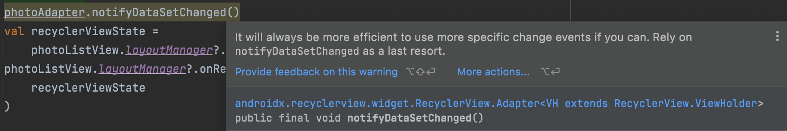

<span style="display: inline-block; width: 100%; text-align:center;">
</span>

## 0. Intro

---

**⚡️ the gallery widget doesn't support multiple selection by default**

안드로이드에서는 기본적으로 기기내 공유 저장소의 미디어 파일에 액세스했을 때 미디어 파일을 여러 개 선택하는 것이 가능하지 않다. <br> api 18이상부터는, `Intent.ACTION_GET_CONTENT`을 이용하여 `image/*`로 setType을 한 다음 `Intent.EXTRA_ALLOW_MULTIPLE`을 설정하면 가능하다지만, 실제로 적용시켜봤을 때는 파일 저장소에는 적용이 되었지만 갤러리에는 적용되지 않았고 그 이하의 api 에서도 적용이 안된다는 점이 있다. 또한 Android 13부터는 `Photo Picker`을 제공하여 모든 미디어 라이브러리를 가져올 필요없이 사진과 영상까지 여러 장 선택할 수 있는 기능을 제공하지만 그 이하의 버전에는 지원되지 않는 점이 있다. 그래서 Intent에서 제공하는 파라미터나 안드로이드에서 제공하는 빌트인 툴을 이용하는 것이 아닌 모든 경우에서 가능한 이미지 피커를 직접 만들기로 결정하였다.

내가 맡고 있는 우리 회사의 서비스 중 유저가 사진을 여러 장 올려서 자신의 피드에 올리고, 물건을 팔고 소싱까지 이루어져야하는 것이 핵심 서비스이다. 그런데 현재 구현된 기능은 안드로이드에서 제공하는 갤러리 위젯을 쓰기 때문에 안드로이드 기종을 쓰는 유저들은 자동적으로 한 장씩밖에 올릴 수 없었고 많은 불편함을 토로하기도 했다. 우리 서비스의 가장 많은 VOC이기도 했다. 부채처럼 지녀왔던 기능을 저장소에 직접 접근하여 처음부터 끝까지 커스텀하는 방향으로 잡아 개발을 맡게 되었고 기기에 내장된 데이터를 가져오는 과정에서 생긴 성능 문제등을 개선하면서 어떻게 구현했는지 그리고 깨달았던 점들을 쓴다.

## 1. Access media files from shared storage

---

**⚡️ MediaStore is the richest set of APIs for accessing shared files.** <br>

사진을 여러 장 선택하는 멀티 셀렉의 구현 자체는 어렵지 않다. Images 형식의 미디어 파일들을 한꺼번에 가져와서 리사이클러뷰로 구현하고 마치 실제 앨범처럼 구현한다음 여러 장 선택하여 저장소로 보내면 된다. 관건은 어떻게 기기내 외부저장소의 모든 폴더와 사진들을 가져올 것인가였다. 그리고 구현해야할 UIUX 대로라면 각 폴더별 갖고 있는 사진 데이터와 사진 장수 등 필요한 정보들을 적절하고 정확하게 가져와야했다. 이 때 쓰이는 개념이 `MediaStore`, `Content Provider`와 `Content Resolver` 이다.

`Content Provider`는 어플리케이션 사이에서 데이터를 공유하는 통로 역할을 한다. 단말기에 저장된 이미지, 동영상, 오디오 파일의 정보를 제공하는 프로바이더이다. 이 프로바이더에게 우리가 찾고 싶은 종류의 데이터를 쿼리할 수 있다. 컨텐트 프로바이더가 안드로이드 시스템의 각종 설정값이나 DB에 접근하게 해 준다면 결과를 반환하는 브릿지 역할을 `Content Resolver`가 한다. 컨텐트 리졸버로 우리는 파일 이름, 저장된 시간, 저장된 위치까지 알 수 있다. `MediaStore`는 앱이 콘텐트 리졸버가 제공하는 파일들을 접근할 수 있도록 도와주는 API들의 묶음이다. 쿼리에 필요한 데이터들이 정의되어있다. MediaStore의 API들이 어떤 의미인지 이해하고, 그 API를 통해 Content Resolver에 쿼리를 하여 데이터를 얻으면 된다.


### 1-1) 권한

Content Provider에서 파일을 읽으려면 Android Manifest에 권한을 추가하고, 사용자에게도 권한을 받아야한다. Android 10 부터의 Scoped Storage는 기본적으로 앱이 디바이스의 모든 파일을 탐색하지 못한다는 전제가 있다. 그래서 공용 미디어 파일들은 `READ_EXTERNAL_STORAGE` 권한이 있어야한다. 미디어 파일을 수정하려면 `WRITE_EXTERNAL_STORAGE` 권한도 요청해야 한다.

```jsx
<uses-permission android:name="android.permission.READ_EXTERNAL_STORAGE" />
<uses-permission android:name="android.permission.WRITE_EXTERNAL_STORAGE" />
```

### 1-2) 이미지쿼리

MediaStore의 추상화와 상호작용하려면, 앱의 컨텍스트에서 검색한 `Content Resolver` 객체를 사용해야한다. `contentResolver.query()` 를 이용해서 데이터를 조회하는데 5개의 인자가 필요하다. 리턴 타입은 Cursor이며, 이 객체를 통해 찾은 데이터를 확인할 수 있다.

```jsx
val projection = arrayOf(media-database-columns-to-retrieve)
val selection = sql-where-clause-with-placeholder-variables
val selectionArgs = values-of-placeholder-variables
val sortOrder = sql-order-by-clause

applicationContext.contentResolver.query(
    MediaStore.media-type.Media.EXTERNAL_CONTENT_URI,
    projection,
    selection,
    selectionArgs,
    sortOrder
)?.use { cursor ->
    while (cursor.moveToNext()) {
        // Use an ID column from the projection to get
        // a URI representing the media item itself.
    }
}
```

위의 조건으로 쿼리한 데이터가 있다면 Cursor로 결과를 순회할 수 있다. 각각의 인자는 다음과 같은 의미이다.

- `Uri`: 찾고자하는 데이터의 Uri.

  쿼리 api는 인자로 전달되는 Uri내에서 데이터를 찾는다. `content://scheme` 방식의 원하는 데이터를 가져오기 위해 정해진 주소라고 보면 된다.

  만약 `MediaStore.Images.Media.EXTERNAL_CONTENT_URI` 라는 Uri를 인자로 전달하였다면 이 Uri 경로 아래에서만 파일을 찾고 출력하면 다음과 같이 나온다.

  `content://media/external/images/media`

- `Projection`: DB의 column과 같다.

  ArrayList<String> 타입을 가지며 결과로 받고 싶은 Column 명을 배열에 추가하면 projection 이름처럼 투영하여 결과값들을 찾아준다.

  보통 많이 쓰이는 컬럼의 종류는 다음과 같다.

  MediaStore.Images.Media.\_ID <br>
  MediaStore.Images.Media.DATA <br>
  MediaStore.Images.Media.DISPLAY_NAME <br>
  MediaStore.Images.Media.TITLE <br>
  MediaStore.Images.Media.DATE_TAKEN <br>
  MediaStore.Images.Media.DATE_ADDED <br>

* `Selection`: DB의 where 키워드와 같다.

  어떤 조건으로 필터링된 결과를 받을 때 사용한다. 예를 들어 `MediaStore.Images.Media.DATE_TAKEN`를 이용해서 원하는 날짜 기준을 설정해 구할 수 있다.

* `Selection args`: Selection과 함께 사용된다.
* `Sort order`: 쿼리 결과 데이터를 sorting할 때 사용된다.

파일이 찍힌 시간에 대한 내림차순과 오름차순으로 정렬하는 코드이다.

```jsx
val sortOrderDesc = "${MediaStore.Video.Media.DATE_TAKEN} DESC"
val sortOrderAsc = "${MediaStore.Video.Media.DATE_TAKEN} ASC"
```

<br>

이미지 정보를 가져오기 위한 Uri인 `MediaStore.Images.Media.EXTERNAL_CONTENT_URI` 이다. `MediaStore.Images.Media.DATA`는 이미지의 절대적인 경로를 나타낸다. Curosor로 모든 데이터를 순회하며 데이터가 있을 경우 리턴 받은 Cursor의 첫 번째 행에 이미지의 절대적인 경로가 들어있다. Cursor로 Column을 읽을 때는 getLong() 또는 getString()에 column의 index를 넣는다.

```jsx
  private fun getPictureList(): ArrayList<String> {
        val uri = MediaStore.Images.Media.EXTERNAL_CONTENT_URI
        val projection = arrayOf(
            MediaStore.Images.Media.DATA,
            MediaStore.Images.Media.DATE_TAKEN
        )

        val sortOrder = "${MediaStore.Video.Media.DATE_TAKEN} DESC"
        val cursor = context.contentResolver.query(uri, projection, null, null, sortOrder)
        val folderMap = ArrayList<String>()
        if (cursor != null) {
            while (cursor.moveToNext()) {
                val columnIndex = cursor.getColumnIndex(MediaStore.Images.Media.DATA)
                try {
                    val folder = cursor.getString(columnIndex)
                    folderMap.add(folder)
                } catch (e: Exception) {

                }
            }
            cursor.close()
        }
        return folderMap
    }
```

## 2. 비동기처리

---

**⚡️ This application may be doing too much work on its main thread!**

처음 이미지 업로드하기 버튼을 눌렀을 때 앨범이 뜨기 전까지의 로딩이 걸린다면 사용자경험은 좋지 않을 것이다. </br> 처음에는 쿼리가 돌아가는 모든 함수들을 갤러리 액티비티가 onCreate할 때 실행하도록 했는데, 이 때 많은 사진들을 가진 유저라면 처리되는 시간이 길어져 앨범 자체가 늦게 뜨는 현상을 발견했다. (This application may be doing too much work on its main thread!) 그래서 모든 사진들을 가져오는 함수와 각 폴더별 정보를 가져오는 함수는 다른 쓰레드에서 처리하도록 하였다.

또한, Content Resolver의 쿼리를 작성한 함수에서도 많은 반복문이 돌아 성능이 현저히 낮아지는 현상도 있었다. 예를 들어 폴더를 선택하는 뷰에서는 폴더이름, 폴더의 대표이미지, 사진갯수가 필요했는데 각각의 데이터를 추출하는 함수를 작성하였고 쿼리 반복문이 3번 돌게 됐었다. Cursor가 한 번에 돌 때 원하는 데이터들의 칼럼을 설정해 찾는 로직을 세우고 한 번에 세 개의 데이터들을 리턴하는 함수를 작성하여 불필요한 Cursor의 순회를 없앴고 성능 향상으로 이어졌다.

## 3. notifyDataSetChanged() vs DiffUtil

---

**⚡️ Rely on notifyDataSetChanged as a last resort**

리사이클러뷰를 업데이트하는 여러 방법 중, notifyDataSetChange()를 쓰면 arctic fox버전부터 이 메소드는 last resort로 쓰는 것이 좋다는 warning이 뜬다.<br>

<span style="display: inline-block; width: 100%; text-align:center;">last resort라며...!</span>

안드로이드 스튜디오에서도 권장하고 있고 전체를 변경해주는 `notifyDataSetChange()` 보다 `DiffUitil`는 변경된 부분만 업데이트 해주므로 당연하게도 DiffUtil을 사용하고 있었다. 그런데 사진 폴더를 클릭하고 각 폴더에 들어있는 사진들을 보여줄 때 빠르게 업데이트가 되지 않는 현상이 있었다.

병목이 어디서 일어난 걸까? <br> 처음에는 쿼리가 도는 함수에서 많은 시간이 걸리는 것이 아닌지 그 쪽으로만 생각했는데 contentResolver 에서 해당 폴더의 사진 리스트들을 가져오는 부분은 비동기로 처리해줬기에 빠른 속도로 실행되고 있었다. DiffUtil 클래스를 사용했을 때, 데이터를 비교하는 과정에서 시간이 소요가 되는 것을 확인할 수 있었다. 즉, RecyclerView의 ViewHolder에 binding 되기 전까지의 시간이 소요됐다. 그럼 데이터간 다른점을 비교하는 부분을 살펴봐야하는데 이 부분을 어떻게 비교했는지에 따라서도 시간은 달라질 수 있다. `areItemsTheSame`에서 사진의 path를 비교하며 이 path를 곧 고유한 id처럼 썼었다. 하지만 항상 폴더를 바꿀 때마다 모든 path는 달라지며 DiffUtil의 비교 알고리즘은 모든 아이템에 적용되고 있었다.

> Then What's the problem?<br>
> When we use notifyDataSetChanged() method it updates all the view (all visible view on screen and few buffer view above and below the screen). It's inappropriate way of updating list if just a few rows have changed. For example, your friend changes the status on WhatsApp then only that row should be updated instead of all the rows.

다시 정리하자면, notifyDataSetChanged()는 현재 보여지지 않는 부분까지 모든 UI를 새로 갱신한다. 구조는 같고 완전 새로운 데이터의 업데이트가 일어나는 경우에 이 메소드를 쓰는 것이 적합하다. DiffUtil은 oldList와 newList를 비교하여 차이를 계산하고 newList로 갱신해주는 유틸리티 클래스이다. DiffUtil 클래스를 사용하면 아이템 변경의 구체적인 상황에 따라 리사이클러뷰가 제공하는 adapter의 적절한 메소드를 호출하지 않아도 된다.

나의 경우에는 폴더 이름을 클릭할 때마다 겹치는 데이터 없이 각 폴더에 들어있는 새로운 사진들을 가져와야 했기 때문에 구조는 같고 완전 새로운 데이터의 업데이트가 일어나는 경우였다.

이처럼 모든 View가 갱신되어야 하는 경우라면 notificationDataSetChanged()가 더 빠른건 당연한 것이었다. 고유한 id를 비교할 필요없이 새롭게 view를 업데이트 해야하므로 DiffUtil의 알고리즘이 돌 필요가 없었다. 그래서 폴더별로 사진을 셋팅해주는 건 notifyDataSetChanged() 메소드를 썼고, 멀티셀렉할 때 특정 사진만 선택할 때의 뷰의 업데이트는 DiffUtil을 사용하였다.

Content Provider로 앱과 저장소 사이에서의 데이터 접근과 Content Resolver를 통해 앱의 데이터베이스를 공유까지 해 본 기회였다. 더 나아가 이미지,영상 등 더 많은 콘텐츠 영역들을 다뤄보고 싶다.

## 4. 참고자료

---

- https://developer.android.com/training/data-storage/shared/media#request-permissions
- https://medium.com/mindorks/diffutils-improving-performance-of-recyclerview-102b254a9e4a
