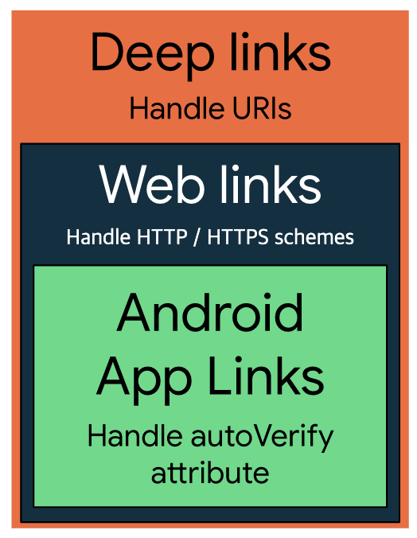
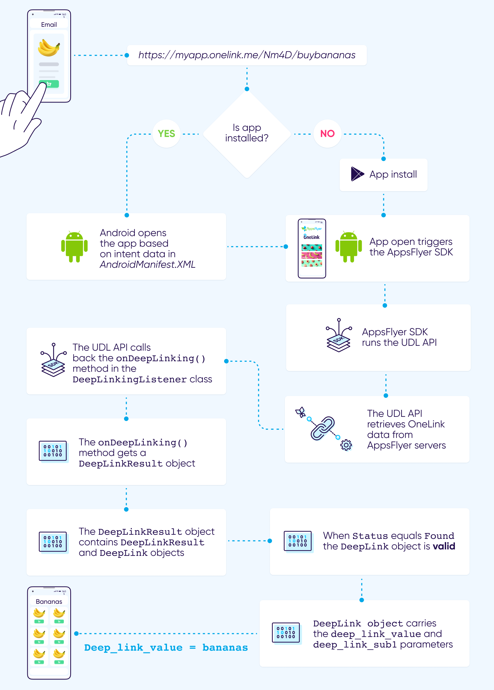

## One goal of Links

---

> **Users following links on devices have one goal in mind: to get to the content they want to see.**

한 번은 프론트엔드 동료 개발자분이 웹은 웹 주소에 따라 다른 페이지를 보여주는데 앱도 페이지마다 식별할 수 있는 주소가 있는지 여쭤보셨다.
언제든 해당 url만 있으면 접근할 수 있는 웹과 달리 앱은 activity가 고유한 주소값을 가지고 있지 않기도 하고 직접적으로는 특정 페이지에 도달할 수 없다. 독립적이고 폐쇄적인 성격을 가진 앱의 특성때문이다. http 기반으로 문서를 주고받는 웹의 배경과도 다르기에 모바일에서도 딥링킹할 수 있는 방법이 필요해졌다.

그래서 Android, iOS에서는 딥링크를 구현할 수 있도록 여러 성격을 가진 링크들을 지원하기 시작했다. `딥링크` 를 통해서는 실행하고자 하는 activity 를 지정하지 않고 단순히 url만을 입력하고 실행하는데도 직접적으로 안드로이드 앱 내의 액티비티에 접근하는것이 가능하다. 다른 앱에서 또는 웹 브라우저에서 링크를 클릭했을때 특정 activity를 실행시킬수 있다. 이처럼 activity도 웹처럼 해당 route로 이동하는 효과를 가지는 것이다.

이와 같은 역할을 하는 것을 크게 딥링크라고 정의하며 안드로이드에서는 크게 3가지의 링크들로 구분되어 있다. **하지만 모두 특정한 콘텐츠나 페이지에 도달하기 위한 링크라는 하나의 목표를 가지고 있다.**

- `Deep links`
- `Web links`
- `Android App Links`

</br>
<div style="text-align:center">Capabilities of deep links, web links, and Android App Links</div>
</br>

위와 같은 링크들은 특정 주소 혹은 값을 입력하면 **앱의 특정한 페이지나 콘텐츠에 바로 이동시킬 수 있게 해주는 역할**을 한다. 때문에 광고, 마케팅에도 많이 사용되며 이러한 링크를 클릭한 유저에게 앱이 바로 실행되어 특정 화면으로 이동하는 경험을 할 것이다.

## 1. Deep links

---

> **Deep links are URIs of any scheme that take users directly to a specific part of your app.**

- `scheme://host_path`

URI scheme을 이용한 딥링크는 scheme값을 등록하는 형태로 앱을 구분한다. 스킴은 앱마다 등록할 수 있는 값으로 **특정 스킴값을 호출하면 해당 스킴값을 가진 앱이 열린다.** 만약 인스타그램 앱을 오픈하고자 한다면 instagram:// 라는 스킴값을 이용하면 되는 것이다. 이 스킴값은 앱 개발시 효율적인 앱 오픈을 위해 자체적으로 개발사에서 자신들만의 값으로 등록을 하게 되고 custom scheme을 갖게 되는 것이다.

URI에 대해 조금 더 짚고 넘어가자면, URI는 `Uniform Resource Identifier`라는 의미로 **리소스를 나타내는 식별자** 이다. URI은 다음과 같은 구조로 이루어져 있다.

```jsx
<scheme>://<host>:<port>[<path>|<pathPrefix>|<pathPattern>]
```

앱을 개발하는 주체가 앱 내 특정 페이지마다 path값을 등록하는 형태로 페이지를 구분한다. 해당 주소를 클릭하면 앱이 열리고 지정했던 특정 페이지가 열린다.

- `scheme` : 앱 개발자가 정한 값으로 앱을 구분
- `path` : 앱 내 특정 페이지를 지정
  </br>

URI scheme 방식을 이용하기 위해 manifest의 실행시키고 싶은 activity에 `intent-filter`를 달아준다. intent는 `data`라는 정보를 갖고 있다. 인텐트가 어떤 데이터를 갖고 있는지 표현하고, broadcast 등을 전달할 때 어떤 리시버로 전달 되어야하는지 나타낸다. 이 **data는 URI로 표현**된다. 이렇듯 manifest에 처리할 수 있는 URI를 선언하기 때문에 시스템은 URI 정보를 비교하여 누구에게 Intent를 전달할지 결정할 수 있다.

```jsx
val uri: Uri = Uri.parse("https://comic.naver.com/webtoon/weekday")
intent.data = uri
```

```jsx
<activity android:name=".app.view.SchemeActivity" android:exported="true">
  <intent-filter>
    <action android:name="android.intent.action.VIEW" />

    <category android:name="android.intent.category.DEFAULT" />
    <category android:name="android.intent.category.BROWSABLE" />

    <data android:host="signin" android:scheme="instagram" />
  </intent-filter>
</activity>
```

`Uri.parse()`를 이용하여 문자열을 Uri객체로 만들 수 있다.

```jsx
val uri: Uri = Uri.parse("https://comic.naver.com/webtoon/weekday")
Log.d(TAG, "scheme: ${uri.scheme}, host: ${uri.host}, port: ${uri.port}, path: ${uri.path}")
```

```jsx
MainActivity: scheme: https, host: comic.naver.com, port: -1, path: webtoon/weekday
```

예를 들어 사용자가 https://comic.naver.com/webtoon/weekday 이라는 링크를 눌렀을 때 앱은 이것을 인텐트로 만들고 startActivity()를 호출한다. 그리고 시스템은 Intent의 데이터를 처리할 수 있는 앱을 찾는다. 이 때 넘겨준 URI의 scheme, host등을 parsing하여 관련 있는 앱을 찾는다. 이런 인텐트는 browser들이 처리할 수 있기 때문에 코드를 실행하면 browser가 실행된다.

```jsx
val i = Intent(Intent.ACTION_VIEW, Uri.parse("https://comic.naver.com/webtoon/weekday"))
startActivity(i)
```

이렇듯 URL을 실행하고 싶을 경우 해당 URL을 적어주고 `ACTION_VIEW`를 실행하면 브라우저가 실행되고 지정한 URL을 실행시킨다.

다시 매니페스트의 예제로 돌아가서, scheme://host 형태의 URL을 정의한다. data에 scheme은 instagram, host는 signin으로 정의하면 instagram://signin가 우리 앱의 딥 링크로 설정된 것이다. 따라서 instagram://signin 이라는 URL을 호출하는 경우 `intent-filter`를 통해 우리가 지정했던 activity로 바로 접근할 수 있게 된다. activity를 실행하면서 parameter를 넘겨주고 싶은 경우 쿼리형태로 넘겨줄 수도 있다.

딥링크를 테스트해 보고 싶을 때, 아래의 커맨드를 실행시키면 된다.

```jsx
$ adb shell am start
        -W -a android.intent.action.VIEW
        -d "example://gizmos" com.example.android
```

### 1-1). URI scheme 방식의 한계

만약 같은 scheme을 가진 앱이 있다면? </br>
가장 쉽게 접근할 수 있는 URI scheme 방식은 점차 앱이 증가할 수록 scheme 값이 중복되는 경우가 발생했다. 앱 개발자가 scheme 값을 자유롭게 설정할 수 있기 때문에 고유한 URI를 가지기 어려워졌다.

딥링크를 실행시켰을 시 같은 `scheme`를 가진 앱이 있다면 어떤 앱을 열것인지 선택해야하는 다이어로그가 뜰 것이다. 예를 들어 구글 스토어 앱은 자신들의 앱을 오픈하기 위한 스킴 값으로 `market://` 란 값을 사용하고 있다. 이 후 원스토어와 galaxy store도 동일한 URI scheme 값을 사용했다고 한다. 동일한 스킴으로 배포되는 앱들이 점차 많아지고 규모가 큰 앱들의 scheme을 하이재킹하며 이러한 문제가 생기게 되었다. 구글 플레이 스토어로 이동되길 의도되었던 scheme이었는데 galaxy store으로 고정하는 순간 나머지 두 개의 앱은 이후 딥링크로서의 기능을 잃어버리게 된다. 개발자 입장에서도 앱에 등록된 scheme값이 자신들만이 쓰는 고유한 scheme값인지 확인할 방법이 없다. 또한 모바일이나 웹에서 앱 scheme을 요청했을 때 앱이 설치되어 있지 않다면 예외를 발생시키거나 아무 일도 일어나지 않는다. 개발자는 앱이 설치되어있지 않을 때의 예외처리를 해줘야하는데 URI scheme을 브라우저에서 작동하는 웹 클라이언트쪽에서 조건을 처리해줘야한다. 처리하는 방식은 많겠지만 iframe으로 URI scheme으로 앱 구동을 시도하며 반응이 없을 경우(구동에 실패하는 경우) 구글 플레이 스토어로 이동시키게 한 코드이다.

```jsx
const runFallback = () => {
  window.location.replace("market://details?id=com.myapp.package")
}

const addIFrame = () => {
  var iframe = document.createElement("iframe")
  iframe.style.border = "none"
  iframe.style.width = "1px"
  iframe.style.height = "1px"
  iframe.src = "your_uri_scheme://"
  document.body.appendChild(iframe)
}

addIFrame()
setTimeout(() => {
  runFallback()
}, 1000)
```

이렇듯 이와 같은 URI scheme 방식의 단점을 근본적으로 막기 위해 구글과 애플에서는 각각 `Android App Links`와 `Universal Links`를 제공한다.

## 2. Android App Links

---

> **Android App Links are web links that use the HTTP and HTTPS schemes and contain the autoVerify attribute.**

앱링크와 유니버셜 링크는 인증된 웹사이트 URL을 기반으로 하는 딥링크이다. **OS에 앱에 대한 도메인 주소를 등록함으로써 소유권을 증명한다.** 도메인은 각 웹 사이트마다 가지고 있는 고유한 인터넷 주소로 도메인 소유자만이 관리할 수 있기 때문에 소유권이 증명되며 고유함이 보장된다. 애플과 구글에서는 이 도메인 주소를 딥링크 실행값으로 사용하기로 결정한다.

앱 빌드 시 앱을 열 도메인을 등록하고, 보안을 위해 등록한 도메인의 특정 경로에 인증 텍스트를 심어 놓는다. 그러면 앱이 설치된 후 OS 레벨에서 해당 도메인 경로의 인증 텍스트와 앱 빌드 시의 값이 동일한지 검증하여 소유권을 인지하게 된다. 일단 검증이 완료된 후에는 앱을 삭제하기 전까지 해당 검증은 유효하다.

검증된 도메인으로 생성된 딥링크를 클릭하거나 브라우저 앱 주소창에 입력하면 앱이 설치되어 있다면 앱 및 특정 페이지가 바로 열리고 앱이 설치 되어있지 않아 딥링크 실패시에는 외부 브라우저에서 웹 페이지를 실행하는데 이를 `fallback url`이라고 한다. 개발자의 구현에 따라 다양한 fallback이 가능하다. 이처럼 URI scheme의 한계점들을 보완하는 듯하다.

### 2-1). App Links의 한계

하지만 모든 앱에서 유니버셜 링크와 앱링크 오픈을 지원하는 것이 아니다. 각각은 OS에서 제공하는 딥링크 형태이기 때문에, 각 OS의 브라우저인 Safari(iOS) 및 Chrome(Android)에서는 딥링크가 잘 동작할 수 있도록 설정되어 있다. Safari의 경우, URI Scheme의 동작은 제한되어 있다. 즉 앱링크는 구글에서 만든 앱에서만 동작하고, 구글 이외에 앱에서는 정상적으로 동작하지 않는다. 유니버셜 링크 역시 애플에서 만든 앱 이외에는 정상적으로 동작하지 않는다.

또한 **데이터 유실**의 문제도 있다. 랜딩 페이지 및 쿼리 파라미터 정보가 포함된 url을 앱이 설치되어 있지 않을 경우 앱 스토어로 이동하면서 잃어버리게 된다. 데이터 분석에 중요한 요소들을 트래킹하기 어려워진다. 이러한 문제를 해결하기 위한 것이 `디퍼드 딥링크(deferred deep link)`이다. 대표적으로 앱스플라이어의 Onelink, 파이어베이스의 Dynamic Links가 있다.

## 3. Firebase Dynamic link

---

> **Deferred deep linking allows users to deep link to content even if the app is not already installed.**

이미 앱을 설치한 사용자라면 앱을 실행시키고 사용자가 앱이 설치되어 있지 않다면 안드로이드인지 아이폰인지 구분해서 해당 마켓으로 보내주는 역할을 한다. iOS, 안드로이드 구분할 필요없이 해당 플랫폼에 맞춰 스토어를 자동으로 열어주고 브라우저에서 열었다면 웹사이트 내 해당 콘텐츠로 이동시킨다. 자체 도메인 이름을 사용하여 동적 링크를 만들 수 있다.

해당 앱 스토어로 이동시켜주는 것 이외에도, 기존 플로우를 유지할 수 있기도 하다. 원래 앱을 실행시켜 특정 콘텐츠로 도달하는 플로우였는데 만약 앱이 설치되어 있지 않을 때 앱을 설치하는 과정에서 특정 콘텐츠로 이동시키는 플로우가 끊기게 된다. dynamic link를 통해 유입해서 앱을 설치한다면 설치 후에도 해당 콘텐츠로 바로 이동할 수 있게 된다. 만약 그 콘텐츠의 depth가 깊으면 깊을수록 사용자는 이탈률도 높아지기에 서비스를 운영하는 입장에서는 최대한 이 단계를 줄여서 사용자가 원하는 정보에 도달시켜주는것이 중요하며 때문에 dynamic link가 사용자를 유입시키는데 효과적인 역할을 한다.

appsflyer의 구동방식을 순서대로 따라가 보자면,
</br>



  <div style="text-align:center">flow of appsflyer</div>
</br>

1. 사용자는 솔루션을 통해 생성된 딥링크를 클릭
2. 앱이 설치되어있지 않다면, OS별 앱을 다운받을 수 있는 스토어로 이동
3. 앱이 실행될 때 솔루션에서 제공하는 SDK를 초기화
4. SDK 내부적으로 DB를 통해 기기식별 및 딥링크 데이터 조회
5. 조회된 데이터를 통해 원하는 페이지로 딥링킹
6. 생성된 딥링크를 클릭할 때 자동으로 솔루션에 URL 정보가 전송
7. 나중에 앱이 실행되었을 때 SDK를 통해서 해당 사용자가 클릭했던 URL 정보를 가져옴

우리는 필요한 데이터들을 수집할 수 있게 되었고 사용자는 원하는 페이지로 이동할 수 있게 되었다.

우리 서비스 같은 경우, 서비스를 이용하는 유저들은 상품을 주문한 동시에 카톡으로 알람받게 된다. 해당 카톡 안 주문보기 버튼을 누르면 외부 링크와 연결되고 하나의 프리뷰 페이지를 열어준다. 그 페이지를 실행시켜 주자마자 앱이 있는 사람들은 주문탭으로 이동시켜 유저들이 주문한 상품들을 보여주어 인앱 유도를 하고, 없는 사람들은 앱을 설치시키기 위해 구글 스토어로 이동시키길 원했다. 이 경우 dynamic link만을 사용하려고 했지만 특정 페이지가 정해진 것이 아닌 여러 페이지를 로직에 따라 다르게 처리해야했고 프리뷰에서 넘어온 주문 고유의 id를 판별해야 앱 안에서의 해당 주문을 보여줄 수 있으므로 이를 parameter로 전달하기 위해 URI scheme 방식의 딥링크도 함께 사용하는 방식을 채택했다. 프리뷰에서 dynamic link로 앱이 있는 지 없는지 먼저 판단하고 setTimeOut으로 URI scheme 방식으로 한 번 더 딥링크를 실행시켜 해당 값을 넘겨주었다.

## 참고자료

---

- https://developer.android.com/training/app-links
- https://en.wikipedia.org/wiki/Mobile_deep_linking
- https://gist.github.com/aaustin/f0eb2a6fc905a791ea0c#file-client-js
- https://medium.com/@kimdohun0104/
