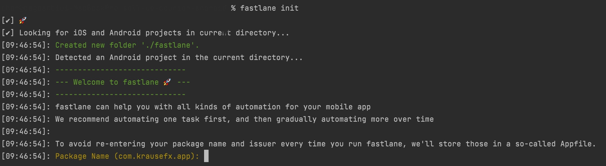
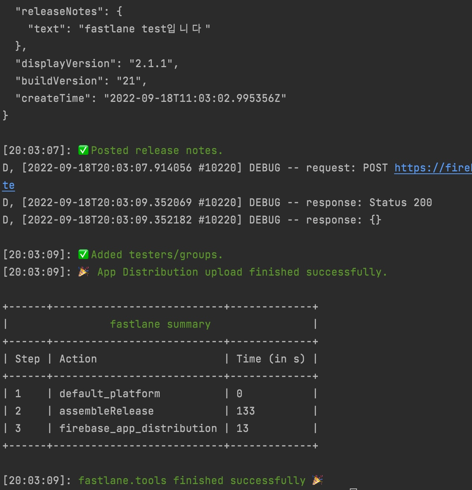
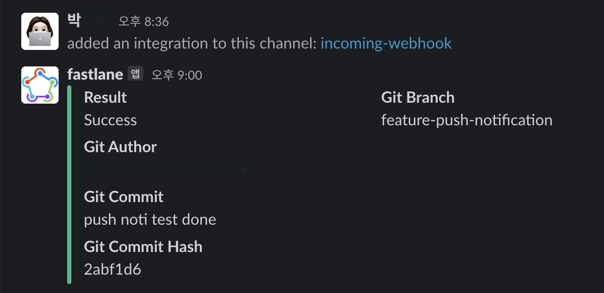
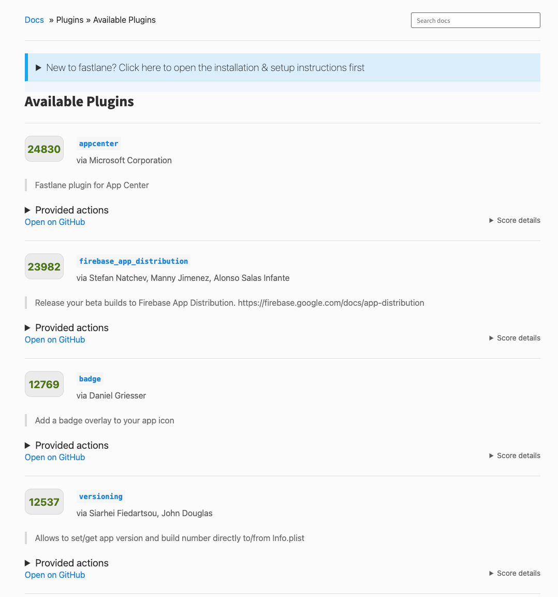

### firebase app distribution + fastlane + slack = 🚀

> `fastlane`은 모바일 플랫폼에서의 `CD(Continuous Deploy)`의 대표적인 툴로 fastlane을 이용하여 테스트앱 자동 배포화부터 (feat.App Distribution)부터 App Store에 등록하는 것까지 다뤄본다.

## 기존 테스트앱 배포방식

---

1. PlayStore 내부 테스트 트랙<br>
   기존의 테스트앱 배포방식은 직접 안드로이드 스튜디오에서 기기를 연결하여 빌드한 수동 중의 수동 배포 방식이었다.(..🐒) 그 이후 QA까지 완료되었고, 우리 서비스를 쓰는 일부 내부 클라이언트들에게만 실제 사용을 위한 테스트 배포를 위해서 PlayStore Beta로 내부 테스터에게만 배포했었다. 이 과정에서도 수동적으로 버전 코드와 네임을 올려가며 secret키를 포함한 앱 번들파일을 직접 올려야하는 번거로움이 있었다.

2. App Distribution<br>
   iOS의 `Testflight`처럼 firebase에서 제공하는 `App distribution`을 알게 되었고 도입해 보았다. 테스터들은 tester app만 설치하고 초대메일의 링크로 앱을 다운받으면 되는 방식이다. 직접 빌드해서 QA를 했던 상황에서 앱 초대메일만 보내고 테스터들이 다운받아 설치하면 되는 방식이니 편하더라(..) 하지만 이 또한 앱을 빌드해서 firebase에 apk나 abb 파일을 직접 올려야하는 방법이었다. 이렇게 수동으로 firebase에 올라간 파일들은 최신화된 파일 하나만 올라간 것이 아니라 앱 버전이 같아도 계속해서 파일들이 쌓여 지저분하게 관리가 됐다.

3. Fastlane을 선택한 이유
   <br>

   > <a href="https://fastlane.tools/">fastlane</a> is an open source platform aimed at simplifying Android and iOS deployment.

   fastlane은 iOS및 Android 앱의 빌드와 출시를 자동화하는 오픈소스 도구이다. 배포 자동화만 지원해주는 줄 알았는데 앱 서명/인증서관리 또한 지원한다. iOS에서 인증서 갱신, 생성, 삭제로 인해 빌드가 되지 않는 과정을 자동으로 관리해줘서 안드로이드에서 보다는 iOS에서 특히 더 많이 쓰는 듯하다. plugin과 actions, 그리고 많은 CI과 협업툴 제공 등 편리하게 쓸 수 있을 기능들이 많았다.
   firebase의 <a href="https://firebase.google.com/docs/app-distribution/android/distribute-fastlane">공식 문서</a>에서 또한 fastlane + firebase app distribution의 조합을 추천했고 테스트앱부터 앱 스토어 등록하는 것까지 fastlane을 이용하여 자동 배포화를 해보는 것으로 결정했다.

## 적용

---

서비스 연동을 위한 api키 생성, fastlane 설치, fastlane과 firebase app distribution 연결, 배포 lane 설정까지 알아본다.

google play conosole에서 서비스 api키를 설정해야하는데 개발자 계정 소유자 권한만 가진 사람만 설정할 수 있다. 나같은 경우는 관리자 권한을 가지고 있더라도 접근이 안됐기에 소유자 계정으로 서비스 계정을 생성했다. 서비스 계정 생성하는 방법은 fastlane을 적용하는 것보다 쉬우니 생략하도록 한다.

### 1-1) fastlane 설치 & 초기세팅

아래 커맨드로 fastlane을 먼저 설치한다. fastlane은 Ruby로 만들어졌는데 homebrew를 사용한다면 Ruby를 따로 설치할 필요없이 적절한 Ruby 버전과 함께 설치해주므로 homebrew로 설치했다.

```jsx
brew install fastlane
```

설치할 프로젝트의 디렉토리에서 fastlane 초기셋팅을 해준다. fastlane init을 실행했을시 플랫폼이 iOS인지 Android인지 판별하여 플랫폼에 맞는 환경세팅 커맨드가 나온다. 안드로이드같은 경우는 `package_name` 세팅, `json_key_file`의 path와, `meta data` 설정이 들어간 것을 볼 수 있다. iOS같은 경우는 안드로이드의 package이름과 같은 app_identifier와 애플 계정등이 들어간다. 나같은 경우는 json파일을 app의 root에 넣어놓고 .gitignore에 올렸다. 2,3번은 나중에 다시 세팅해줄 수 있다.

```jsx
fastlane init

>>> after init
1. package name:
2. JSON secret file path:
3. metadata, screenshot, build(y/n)
```



설치가 끝나면 `Gemfile`, `Gemfile.lock`이 설치가 되고 `fastlane` 폴더와 그 안에 크게 `Appfile`, `Fastfile` 파일이 생성된다. Gemfile과 Gemfile.lock은 ruby bundler가 Gemfile에 적혀있는 내용을 보고(버전관리) 실행하기 위함이다. fastlane은 Appfile에 기입된 내용을 보고 환경 셋팅을 한 후 Fastfile을 참고하여 특정기능을 수행하도록 진행한다.

- Appfile

  > it defines configuration information that is global to your app

  fastlane init에서 설정한 앱 패키지 이름과 secret JSON 파일의 경로가 담겨있다.

2.  Fastfile

    > it defines the "lanes" that drive the behavior of fastlane

    배포에 필요한 모든 정보들을 담고 있다. 크게 platform,lane을 설정한다. fastlane의 기능들을 lane으로 정의한 후 lane 별로 어떤 동작을 시킬지, lane 실행전/후에 어떤 동작을 수행할 지 설정하는 곳이다.

```jsx
default_platform(:android)

platform :android do
  desc "Runs all the tests"
  lane :test do
    gradle(task: "test")
  end

  desc "Submit a new Beta Build to Crashlytics Beta"
  lane :beta do
    gradle(task: "clean assembleRelease")
    crashlytics

    # sh "your_script.sh"
    # You can also use other beta testing services here
  end

  desc "Deploy a new version to the Google Play"
  lane :deploy do
     gradle(task: "clean assembleRelease")
     upload_to_play_store
  end
```

### 1-2) app distribution 연결

다음으로 fastlane과 firebase app distribution을 연결해준다.
fastlane은 많은 plugin들을 제공하는데, add_plugin을 할 때마다 `PluginFile`에 업데이트가 된다.

```jsx
fastlane add_plugin firebase_app_distribution
```

firebase 인증을 하기 위해 login관련 커맨드를 실행시키고

```jsx
fastlane run firebase_app_distribution_login
```

커맨드에 뜨는 auth url에서 리턴해주는 token값을 환경변수로 설정해준다.

```jsx
export FIREBASE_TOKEN=token
```

## 배포

---

배포를 위한 lane 명령어를 생성해준다.
여러 설정을 해줄 수 있는데, <a href="https://firebase.google.com/docs/app-distribution/android/distribute-fastlane#step_3_set_up_your_fastfile_and_distribute_your_app">Firebase App Distribution - 3단계: Fastfile 설정 및 앱 배포</a>문서에서 볼 수 있다. 나같은 경우는 release note와 firebase에 미리 등록한 tester그룹들을 따로 파일로 빼서 관리했다.

```jsx
desc "Lane for distribution"
lane :distribute do
	gradle( task: "clean assembleRelease")
	firebase_app_distribution(
		app: "Firebase App Id",
        groups_file: "fastlane/testers.txt",
        release_notes_file: "fastlane/release-notes.txt",
		debug: true
	)
end
```

```jsx
fastlane distribute
```



## slack

---

우리 회사는 협업툴로 슬랙을 사용하고 프론트엔드 파트에서는 슬랙api를 통해 배포시 메세지가 자동으로 채널에 전송되도록 설정해놓았다. fastlane을 사용하면 슬랙api를 사용할 필요 없이 fastlane의 수행결과를 slack으로 받을 수 있다. slack에서 제공하는 webhook로 앱을 추가하고 해당 url만 Fastfile에 추가해주면 자동으로 연결되어 앱 출시 알람까지 완료할 수 있었다.

slack의 webhook을 이용해야 하는데 webhook이란
서버에서 어떠한 작업이 수행되었을 때 해당 작업이 수행되었음을 HTTP POST로 알리는 개념이다. fastlane에서도 완료 메세지를 전송하려면 이 webhook을 사용해야 하는 것이다. <a href="https://my.slack.com/services/new/incoming-webhook/">이 Incoming-WebHook 앱</a>을 Slack Workspace에 설치한다. Customize name, Customize icon을 앱을 생성하는 슬랙 페이지에서 지정해줘도 되지만 fastlane에서 slack 형식에 맞게 이미 모든 프로퍼티가 마련되어 있다.

<a href="https://docs.fastlane.tools/actions/slack/">fastlane docs</a>의 examples에서는 slack에서 제공하는 기본적인 함수와 프로퍼티들만 나와있지만, 슬랙에서 제공하는 메세지 레이아웃 프로퍼티등 <a href="https://api.slack.com/messaging/composing/layouts#attachments">slack docs</a> 에서 확인 할 수 있다. 나같은 경우는 메시지 옆의 구분선 bar의 색상을 변경해주고 싶어서 `color` 라는 프로퍼티를 찾아서 추가해주었다.

커맨드를 실행시키면 기본적으로 세팅되어있는 값으로 슬랙메세지가 보내진다.

```jsx
fastlane run slack
```



before_all 전처리 함수로 웹훅 url을 연결시키고 after_all 함수를 통해 슬랙 메세지 셋팅과 에러 처리를 한다.

```jsx
 before_all do
      ENV["SLACK_URL"] = "SLACK_WEB_HOOK_URL"
  end

    after_all do |lane|
      slack(
      message: "Successfully deployed Android Test App"
      username: "Test 봇",
      icon_url: "IMAGE_URL",
      default_payloads: [],
       attachment_properties: {
          fields: [{
            title: "[소매AOS] 테스트앱이 배포되었습니다.",
            value: "test",
            short: true
          }]
        }
      )
  end

  error do |lane, exception|
      slack(
        message: exception.message,
        success: false
      )
   end
```


## plugin

---

<a href="https://docs.fastlane.tools/plugins/available-plugins/">fastlane docs</a> 에서 fastlane에서 제공하는 plugin들을 볼 수 있다. 많이 쓰이는 순서로 플러그인을 볼 수 있고 나같은 경우에는 슬랙 메세지에 version name까지 함께 넣어 메세지를 보내고 싶어서 해당 기능을 제공하는 플러그를 찾아 설치하였다. 설치하는 방법과 제공하는 action들을 깃헙에서 확인해서 적용할 수 있다.



```jsx
fastlane add_plugin versioning_android
```

```jsx
Available actions
android_get_version_code to get the Version Code
android_get_version_name to get the Version Name
android_set_version_code to set the new Version Code
android_set_version_name to set the new Version Name
```

이렇게 해당 액션을 넣어주면 자동으로 version name을 가져와 준다.

```jsx
 Slack(message: "[소매AOS] #{android_get_version_name} 테스트앱이 배포되었습니다."),
```

## .env

---

`dotenv`를 통해 환경변수를 셋팅해줄 수 있다. 기본적인 config들은 `.env.default`에 저장할 수 있고 fastlane은 이를 자동으로 불러온다. 키와 값의 형태로 저장이되고 `ENV[key]`로 지정하면 .env 파일에 있는 값을 불러오게 된다.

나같은 경우는 slack url나, 앱스토어 인증키 등을 설정해두고 .gitignore에 추가하였다.

```jsx
SLACK_URL = "URL주소"
```

## 앱 스토어 배포하기 🎉

---

마찬가지로, 위에서 했던것처럼 Fastfile안에서 명령어들을 입력해서 실행함수를 작성해서 배포한다. 필요한 액션들을 나열하고 빌드 액션을 추가하고 앱스토어에 제출한다는 액션을 추가하면 된다. 여기서 code signing 을 위한 값들을 추가해줘야한다. 나같은 경우는 git_tag를 추가하여 버전관리를 했고 test, playstore 각각에 따른 슬랙메세지를 따로 추가해주었다.

```jsx
  desc "Deploy a new version to the Google Play"
    lane :deploy do |options|
      gradle(task: "clean assembleRelease")
      gradle(
        task: "bundle",
        build_type: "Release",
        print_command: true,
        properties: {
          "android.injected.signing.store.file" => ENV['APP_SIGNING_KEY'],
          "android.injected.signing.store.password" => ENV['APP_SIGNING_STORE_PASSWORD'],
          "android.injected.signing.key.alias" => ENV['APP_SIGNING_KEY_ALIAS'],
          "android.injected.signing.key.password" => ENV['APP_SIGNING_KEY_PASSWORD'],
        }
      )

      upload_to_play_store(
        track: "production",
        skip_upload_metadata: true,
        skip_upload_images: true,
        skip_upload_screenshots: true,
        skip_upload_apk: true
       )
    end
```

빌드 후 로그에 fastlane을 사용하여 얼마나 시간을 단축해주었는지 나오기도 하는데 자동배포의 힘을 다시 한 번 느꼈다. 인증서 관련해서는 env와 로컬에 저장하는 형태로 관리를 하려고 했으나 팀원들과 공유하기 위해 클라우드에 접근해서 올리는 방식도 고려하는 중이다. 이렇게 빌드-파일 업로드-배포-확인 요청을 한 문장으로 자동 배포 완료!
